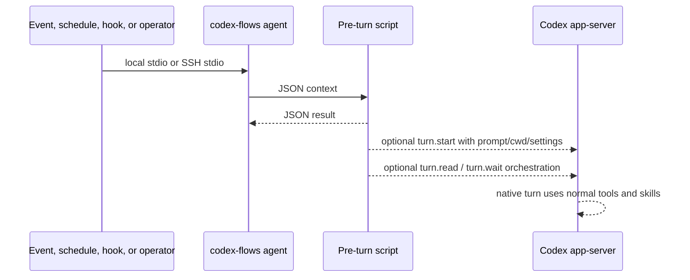

# Architecture

codex-flows centers on plugin-native prompt automation and native Codex turns.
The primary runtime is intentionally narrow: a named automation runs code,
decides whether work is needed, and can start, wait on, and compose native
app-server turns only when there is something worth asking Codex to do.

The agent is the remote-friendly control surface. It owns app-server
pass-through, workspace functions, delegation, automation helpers, and the
policy needed to run scheduled tasks. Product-specific completion still stays
outside codex-flows: each product owns credentials, release rules, external
writes, and final side effects.

Browser dashboards are optional edges. They run `codex-flows-proxy`, fetch
`/api/schema`, and call generic app/workspace methods. The proxy does not add a
second orchestration model.
