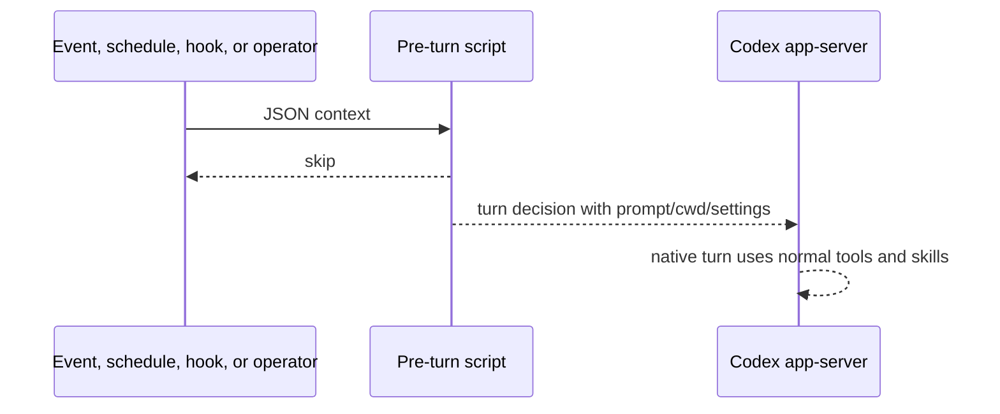

# Architecture

codex-flows centers on plugin-native prompt automation and native Codex turns.
The primary runtime is intentionally narrow: a named automation runs code,
decides whether work is needed, and starts a native app-server turn only when
there is something worth asking Codex to do.

The workspace backend is the remote-friendly control surface. It owns app-server
pass-through, delegation, hook-spool routing, workspace state, and the policy
needed to run scheduled tasks. Product-specific completion still stays outside
codex-flows: each product owns credentials, release rules, external writes, and
the final side effects that happen after a Codex turn.
