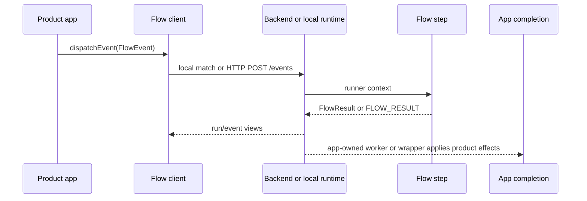

# Architecture

codex-flow separates event semantics, execution, and product completion.

The same flow package can run:

- directly through `codex-flow-runner`
- synchronously through `@peezy.tech/flow-runtime/local-client`
- through the workspace backend's local flow capability
- through a Convex control plane plus an external worker
- through any app-owned backend adapter that preserves the event/result ABI

The important invariant is that the generic layer owns flow state, not product
meaning. A `blocked` result can be surfaced by the backend, but the app decides
what blocked means and how to resolve it.
