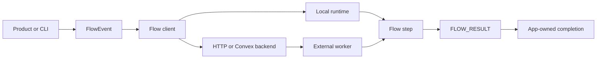

# codex-flow

codex-flow is a small automation system for running reusable Codex work from
generic events. A product emits a `FlowEvent`, a flow package matches it with
JSON Schema, and a runner executes a Bun or gated Code Mode step that prints a
`FLOW_RESULT`.

The stable contract is intentionally narrow:

- Products dispatch generic `FlowEvent` objects with deterministic ids.
- Flow packages declare triggers and scripts in `flow.toml`.
- Steps receive the event through runner context and emit one `FLOW_RESULT`.
- Backends track run state, attempts, output, replay, and cancellation.
- App-owned domain completion stays outside generic flow clients and backends.

## Start here

- New to flows: [Build your first flow](tutorials/first-flow).
- Integrating a product: [Dispatch a release event](tutorials/dispatch-release-event).
- Need exact shapes: [FlowEvent and FLOW_RESULT](reference/flow-event).
- Operating runs: [Operate the workspace flow backend](guides/operate-workspace-flow-backend).

## What is in this repo

- `@peezy.tech/codex-flows`: Codex app-server JSON-RPC client, transports,
  flow helpers, auth helpers, workbench reducers, and generated protocol types.
- `@peezy.tech/flow-runtime`: flow manifest loading, event matching, local
  execution, the shared flow client, and backend HTTP client normalization.
- `@peezy.tech/flow-backend-convex`: reusable Convex control-plane component
  for generic flow events and runs.
- `codex-flow-runner`: CLI for discovering and firing local flow packages.
- `codex-workspace-backend-local`: local workspace backend process with durable
  flow dispatch, inspection, replay, and optional `systemd-run` execution.
- `codex-discord-bridge`: Discord sidecar for routing Discord threads to Codex
  app-server threads, workspace delegation, and flow inspection.
